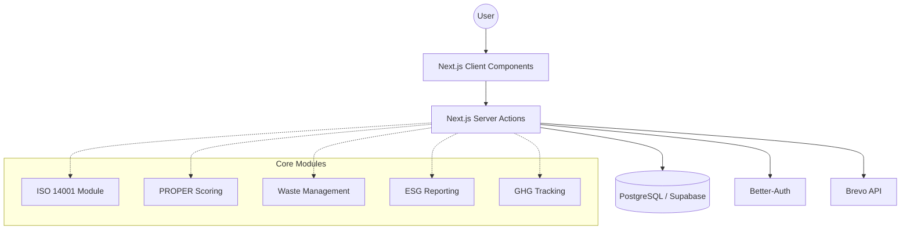
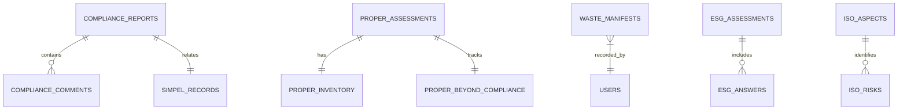

# Technical Blueprint: EcoCompliant-OS
## Comprehensive Environmental Management System (EMS)

### 1. Executive Summary
**EcoCompliant-OS** is a sophisticated, enterprise-ready Environmental Management System (EMS) built with a modern full-stack TypeScript architecture. It is designed to help industrial organizations (Mining, Oil & Gas, Manufacturing) automate compliance with international standards like **ISO 14001:2015** and regional regulations (specifically the Indonesian **PROPER** rating system and **GRI 11** ESG standards).

The application transitions from simple log-keeping to an automated compliance engine, featuring predictive scoring for environmental ratings and automated reporting for various governmental agencies.

---

### 2. Technology Stack
Built on the **"God-Tier" Next.js Stack**, ensuring high performance, SEO optimization, and type safety across the entire application.

| Layer | Technology | Purpose |
| :--- | :--- | :--- |
| **Framework** | Next.js 15+ (App Router) | React framework for server-side rendering and API routes |
| **Frontend** | React 19, Tailwind CSS 4 | Modern, responsive UI with premium aesthetics |
| **UI Components** | Shadcn UI, Radix UI | Accessible and customizable component library |
| **Database** | Supabase (PostgreSQL) | Scalable, managed SQL database |
| **ORM** | Drizzle ORM | Type-safe TypeScript ORM for schema management |
| **Auth** | Better-Auth | Highly secure, flexible authentication system |
| **State/Forms** | React Hook Form + Zod | Robust form handling and schema validation |
| **Charts** | Recharts | Dynamic data visualization for environmental trends |
| **Notifications** | Brevo API | Automated email reporting and alerts |

---

### 3. System Architecture
The application follows a **Modular Monolith** architecture using Next.js Server Components and Server Actions.

---

### 4. Core Modules & Technical Details

#### 4.1. Compliance & PROPER Module
Automates the Indonesian "PROPER" environmental rating assessment.
- **Features**: Predicts rating (Gold, Green, Blue, Red, Black) based on real-time data.
- **Sub-modules**: Water quality tracking, air emission logs, B3 waste management.
- **Tech Logic**: Implements complex scoring algorithms mapped to Indonesian Ministry of Environment regulations.

#### 4.2. ISO 14001:2015 "God-Tier" EMS
A direct technical implementation of the ISO standard clauses.
- **Clause 6.1**: Environmental Aspects & Impacts (Significance scoring matrix).
- **Clause 9.1**: Performance monitoring and measurement.
- **Clause 10.2**: Non-conformity and Corrective Actions (CAPA).
- **Audit System**: Internal and external audit trail with evidence attachments.

#### 4.3. Digital Waste Manifest (Festronik Integration Ready)
Comprehensive waste tracking from generation to final disposal.
- **Domestic Waste**: Tracking organics, recyclables, and residues.
- **B3 (Hazardous) Waste**: Manifest number tracking, storage limits (90/180 days logic), and transporter licensing.
- **Partners**: Database of certified waste transporters and processors.

#### 4.4. ESG Maturity (GRI 11 Alignment)
Automates ESG (Environmental, Social, and Governance) disclosure.
- **Questionnaire Engine**: Multi-level maturity assessment for Climate, Safety, Community, and Governance.
- **Data Export**: Generates standardized disclosures for annual reporting.

#### 4.5. Greenhouse Gas (GHG) Tracking
- **Scope 1, 2, & 3**: Tracking stationary combustion (Scope 1), purchased electricity (Scope 2), and supply chain impacts (Scope 3).
- **Calculations**: Built-in emission factors for CO2e conversion.

---

### 5. Database Schema (Schema-as-Code)
The system uses **Drizzle ORM** for a strictly typed schema. Key tables include:

- **`users` / `sessions`**: Managed via Better-Auth.
- **`compliance_reports`**: Central repository for all regulatory filings.
- **`waste_manifests`**: Core tracking for hazardous waste.
- **`iso_aspects`**: Significance matrix for ISO 14001.
- **`esg_assessments`**: Maturity scores for ESG reporting.

#### ERD Sneak Peek (Primary Entities):

---

### 6. Authentication & Security
- **Role-Based Access Control (RBAC)**: Admin, Specialist, Supervisor, Auditor.
- **Session Management**: Database-persisted sessions using Better-Auth tokens.
- **Environment Isolation**: Strictly managed `.env` variables for sensitive API integrations.

---

### 7. Deployment & Infrastructure
1. **Frontend/Backend**: Vercel or any Node.js VPS.
2. **Database**: Supabase (PostgreSQL) with Row-Level Security (RLS) recommended.
3. **Storage**: Supabase Storage or AWS S3 for PDF manifest/evidence storage.

---

### 8. Scalability & Future Roadmap
- **AI Integration**: Automatic parsing of PDF environmental regulations into the Legal Register.
- **Dashboard v2**: IOT sensor integration via API for real-time water quality monitoring.
- **Mobile App**: PWA or React Native companion for field audits and manifest scanning.

---
**EcoCompliant-OS** represents a high-value asset for any environmental consultancy or large-scale industrial firm looking to digitize their ESG and compliance operations.
